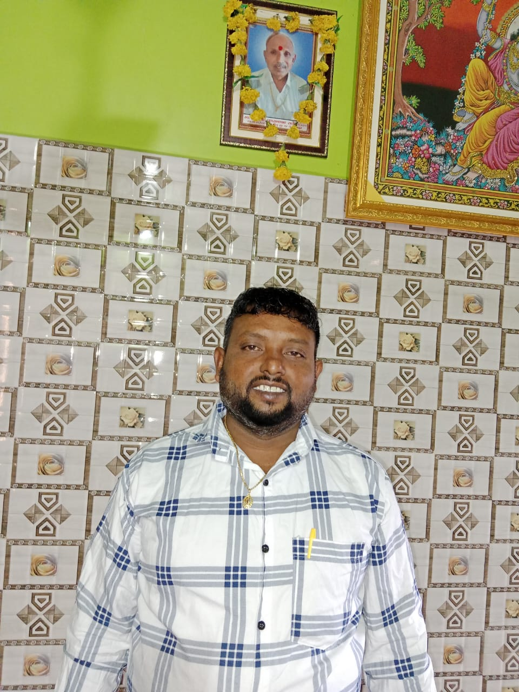

<!DOCTYPE html>
<html lang="en">
<head>
    <meta charset="UTF-8" />
    <meta name="viewport" content="width=device-width, initial-scale=1.0"/>
    <title>Ratandip Constructions</title>
    
</head>
<body>

    <header>
        

            
            <h1>Ratandip Constructions</h1>
        

        <nav class="navbar">
            <a href="#about">About</a>
            <a href="#services">Services</a>
            <a href="#contact">Contact</a>
        </nav>
    </header>

    <main>
        <section class="hero-section">
            <h2>Welcome to Ratandip Constructions!</h2>
            
        </section>

        <section id="about" class="about">
            <h2>About Us</h2>
            

                
                
Ratandip Constructions is a trusted name in delivering top-quality construction projects across the region. With years of experience and a skilled team, we turn your visions into reality.

            

            

                
                
Our commitment to quality and timely delivery has earned us a strong reputation among our clients. We pride ourselves on attention to detail and client satisfaction in every project we undertake.

            

        </section>

        <section id="services" class="services-section">
            <h2>Our Services</h2>
            

                

                    <h3>Residential Construction</h3>
                    
We build durable, stylish, and comfortable homes tailored to your needs and preferences. From custom homes to multi-unit dwellings, we ensure quality craftsmanship.

                

                

                    <h3>Commercial Projects</h3>
                    
From office buildings to industrial facilities and retail spaces, we cover it all. Our commercial construction services are designed to meet diverse business requirements.

                

                

                    <h3>Renovation & Remodeling</h3>
                    
Transform your existing space with our expert remodeling solutions. Whether it's a home renovation or a commercial upgrade, we breathe new life into your property.

                

            

        </section>

        <section id="contact" class="contact-section">
            <h2>Contact Us</h2>
            

                <form>
                    <input type="text" placeholder="Your Name" required aria-label="Your Name"/>
                    <input type="email" placeholder="Your Email" required aria-label="Your Email"/>
                    <input type="tel" placeholder="Your Mobile No." pattern="[0-9]{10}" required aria-label="Your Mobile Number"/>
                    <textarea rows="5" placeholder="Your Message" aria-label="Your Message"></textarea>
                    <button type="submit">Send Message</button>
                </form>
            

        </section>
    </main>

    <footer>
        
&copy; 2025 Ratandip Constructions. All rights reserved.

    </footer>

</body>
</html>
